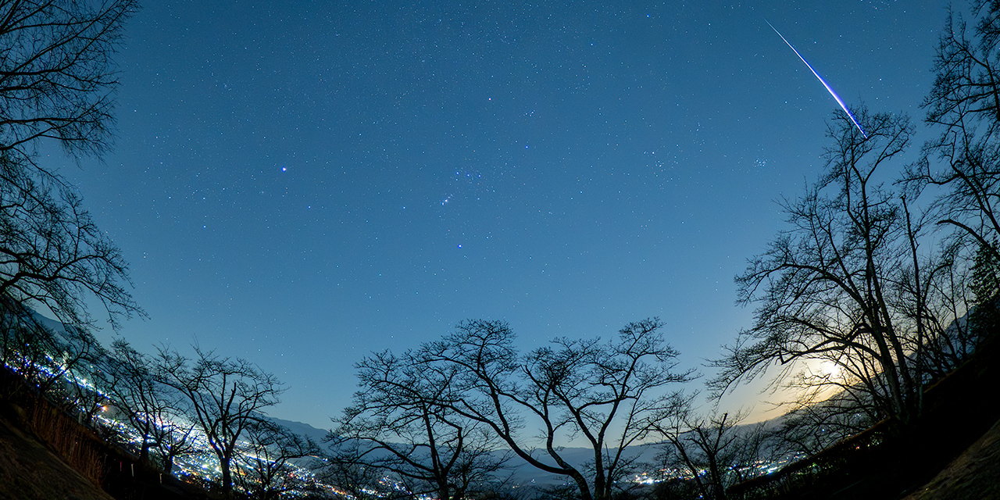

# Detect Meteors CLI



[](https://github.com/shin3tky/detect_meteors/actions/workflows/python-test.yml)

Automatically detect meteors in RAW astrophotography images using frame-to-frame difference analysis.

**Note:** Detection compares consecutive RAW images. The first image is skipped—please check it manually.

## Motivation

During meteor shower events, manually reviewing thousands of RAW images to find meteors is tedious and time-consuming. This tool automates the initial detection process, allowing astrophotographers to quickly identify candidate images for further review.


📅 **Planning your meteor photography?** Check out the [Meteor Showers Calendar](https://github.com/shin3tky/detect_meteors/wiki/Meteor-Showers-Calendar) for upcoming meteor shower dates and viewing tips.

## Features

- **Fully automated**: NPF Rule-based optimization analyzes EXIF metadata and scientifically tunes detection parameters
- **Scientifically validated**: 100% detection rate on real-world test dataset (OM Digital OM-1, 1000+ RAW images)
- **RAW format support**: Works with any format supported by [`rawpy`](https://github.com/letmaik/rawpy)
- **Intelligent processing**: ROI cropping, Hough transform line detection, resumable batch processing
- **High performance**: ~0.18 sec/image with multi-core parallel processing

## Requirements

- Python 3.12+
- macOS, Windows, or Linux
- Dependencies: `numpy`, `opencv-python`, `rawpy`, `psutil`, `pillow`, `pydantic`, `pyyaml`

## Installation

See [INSTALL.md](INSTALL.md) for detailed installation instructions.

## Quick Start

### Step 1: Check EXIF Metadata

```bash
python detect_meteors_cli.py --show-exif
```

Verify focal length is detected. If missing, you'll need to specify it with `--focal-length`.

### Step 2: Run Detection

```bash
# Micro Four Thirds camera
python detect_meteors_cli.py --auto-params --sensor-type MFT

# APS-C camera (Sony/Nikon/Fuji)
python detect_meteors_cli.py --auto-params --sensor-type APS-C

# Full Frame camera
python detect_meteors_cli.py --auto-params --sensor-type FF

# With fisheye lens
python detect_meteors_cli.py --auto-params --sensor-type MFT --focal-length 16 --fisheye
```

### Step 3: Review Candidates

Check the `candidates/` folder for detected meteor images.

## Available Sensor Types

| Sensor Type | Description |
|-------------|-------------|
| `1INCH` | 1-inch sensor |
| `MFT` | Micro Four Thirds |
| `APS-C` | APS-C (Sony/Nikon/Fuji) |
| `APS-C_CANON` | APS-C (Canon) |
| `APS-H` | APS-H |
| `FF` | Full Frame 35mm |
| `MF44X33` | Medium Format 44×33mm |
| `MF54X40` | Medium Format 54×40mm |

List all presets: `python detect_meteors_cli.py --list-sensor-types`

## Inputs and Outputs

- **Input**: Directory of RAW images (default: `rawfiles/`)
- **Output**: 
  - Candidate images in `candidates/` (or custom `-o` path)
  - Optional debug masks with `--debug-dir`
  - `progress.json` for resumable processing

## Resumable Processing

- Interrupt with Ctrl-C anytime
- Resume by running the same command again
- Use `--no-resume` for a fresh start

## Documentation

| Document | Description |
|----------|-------------|
| [COMMAND_OPTIONS.md](COMMAND_OPTIONS.md) | Complete CLI options reference |
| [NPF_RULE.md](NPF_RULE.md) | NPF Rule and focal length handling |
| [INSTALL.md](INSTALL.md) | Installation guide |
| [INSTALL_DEV.md](INSTALL_DEV.md) | Developer setup |
| [PLUGIN_AUTHOR_GUIDE.md](PLUGIN_AUTHOR_GUIDE.md) | Plugin development |
| [Wiki](https://github.com/shin3tky/detect_meteors/wiki) | Technical details |

## What's New in v1.6.3

- **RuntimeParams contract**: Formalized runtime parameter passing with namespaced structure
  - `global_params` for pipeline-wide parameters
  - `detector` dict for per-detector overrides
  - `to_dict()` method for serialization
- **DetectionContext.to_dict()**: Serialize context for logging/debugging (excludes image/mask payloads)
- **Pipeline normalization**: Automatic validation and normalization at all plugin boundaries
- **Legacy compatibility**: Output handlers returning `bool` are wrapped in `OutputResult` with deprecation warning
- **Documentation updates**: Comprehensive Plugin Author Guide for all contract types

For detailed migration information, see [RELEASE_NOTES_1.6.md](RELEASE_NOTES_1.6.md).

### Previous Releases

| Version | Highlights | Details |
|---------|------------|---------|
| v1.6.x | Schema versioning, ML-ready architecture, uv/Ruff toolchain | [RELEASE_NOTES_1.6.md](RELEASE_NOTES_1.6.md) |
| v1.5.x | Plugin architecture, sensor presets, fisheye support | [RELEASE_NOTES_1.5.md](RELEASE_NOTES_1.5.md) |
| v1.4.x | NPF Rule optimization, EXIF extraction | [RELEASE_NOTES_1.4.md](RELEASE_NOTES_1.4.md) |
| v1.3.x | Auto-parameter estimation | [RELEASE_NOTES_1.3.md](RELEASE_NOTES_1.3.md) |
| v1.2.x | Threshold estimation improvements | [RELEASE_NOTES_1.2.md](RELEASE_NOTES_1.2.md) |

See [CHANGELOG.md](CHANGELOG.md) for complete release history.

## Roadmap

See [ROADMAP.md](ROADMAP.md) for upcoming features.

## Authors

Detect Meteors CLI was created by Shinichi Morita (shin3tky).

The NPF Rule implementation is based on the formula developed by Frédéric Michaud of the Société Astronomique du Havre (SAH). See [NOTICE](NOTICE) for full attribution.

## Contributing

Issues and pull requests are welcome. Please open an issue to discuss substantial changes before submitting a PR.

For development setup, see [INSTALL_DEV.md](INSTALL_DEV.md).

## License

This project is licensed under the [Apache License 2.0](LICENSE).
