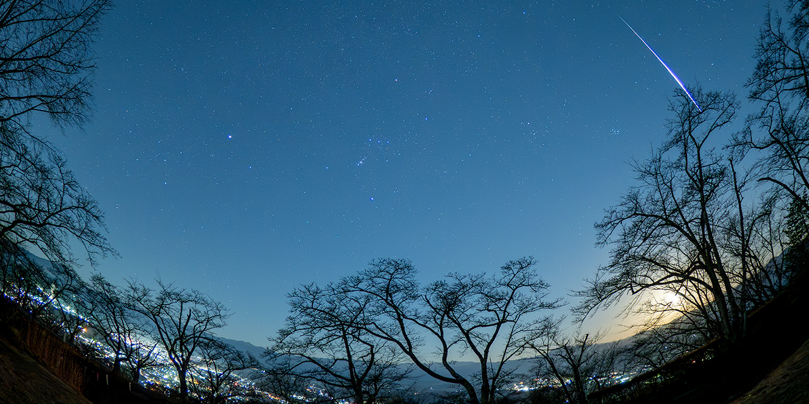

# Detect Meteors CLI

[日本語版](README_ja.md)



[](https://github.com/shin3tky/detect_meteors/actions/workflows/python-test.yml)

Automatically extract meteor candidates from consecutive RAW astrophotography images using frame-to-frame difference analysis. Review the candidates manually to confirm meteors.

## Motivation

During meteor shower events, manually reviewing thousands of RAW images to find meteors is tedious and time-consuming. This tool automates the initial detection process, allowing astrophotographers to quickly identify candidate images for further review.


📅 **Planning your meteor photography?** Check out the [Meteor Showers Calendar](https://github.com/shin3tky/detect_meteors/wiki/Meteor-Showers-Calendar) for upcoming meteor shower dates and viewing tips.

> [!TIP]
> 🌠 **Draconids are coming — October 8-9, 2026!** The Draconids meteor shower peaks on the night of October 8-9, 2026. Don't miss this opportunity to capture stunning meteors! See [Draconids details](https://github.com/shin3tky/detect_meteors/wiki/Meteor-Showers-2026#draconids) for viewing conditions and tips.

## Features

- **Fully automated**: NPF Rule-based optimization analyzes EXIF metadata and scientifically tunes detection parameters
- **Field-tested**: Reported 100% detection rate on the project's real-world test dataset (OM Digital OM-1, 1000+ RAW images); results depend on shooting conditions and parameters
- **RAW format support**: Works with any format supported by [`rawpy`](https://github.com/letmaik/rawpy)
- **Intelligent processing**: ROI cropping, Hough transform line detection, resumable batch processing
- **High performance**: ~0.18 sec/image with multi-core parallel processing

## Requirements

- Python 3.12, 3.13
- macOS, Windows, or Linux
- Dependencies: `numpy`, `opencv-python`, `rawpy`, `psutil`, `pillow`, `pydantic`, `pyyaml`

## Installation

See [INSTALL.md](docs/INSTALL.md) for detailed installation instructions.

## Quick Start

### Step 1: Check EXIF Metadata

```bash
uv run python detect_meteors_cli.py --show-exif
```

Verify focal length is detected. If missing, you'll need to specify it with `--focal-length`.

### Step 2: Run Detection

```bash
# Micro Four Thirds camera
uv run python detect_meteors_cli.py --auto-params --sensor-type MFT

# APS-C camera (Sony/Nikon/Fuji)
uv run python detect_meteors_cli.py --auto-params --sensor-type APS-C

# Full Frame camera
uv run python detect_meteors_cli.py --auto-params --sensor-type FF

# With fisheye lens
uv run python detect_meteors_cli.py --auto-params --sensor-type MFT --focal-length 16 --fisheye
```

> [!IMPORTANT]
> Detection is based on frame-to-frame differences.  
> If you provide **N** RAW files, the tool analyzes **N−1** consecutive pairs (the **first frame is used as the baseline** and is not scored).  
> This is why “100 inputs → 99 processed” is expected—please review the first frame manually.

### Step 3: Review Candidates

Check the `candidates/` folder for detected meteor images.

## Available Sensor Types

| Sensor Type | Description |
|-------------|-------------|
| `1INCH` | 1-inch sensor |
| `MFT` | Micro Four Thirds |
| `APS-C` | APS-C (Sony/Nikon/Fuji) |
| `APS-C_CANON` | APS-C (Canon) |
| `APS-H` | APS-H |
| `FF` | Full Frame 35mm |
| `MF44X33` | Medium Format 44×33mm |
| `MF54X40` | Medium Format 54×40mm |

List all presets: `uv run python detect_meteors_cli.py --list-sensor-types`

## Inputs and Outputs

- **Input**: Directory of RAW images (default: `rawfiles/`)
  - Files are sorted by filename, not EXIF capture time. Use filenames that preserve the shooting sequence.
  - The built-in RAW loader averages each 2×2 block of sensor pixels into one `uint16` pixel; only `binning: 2` is supported.
- **Output**: 
  - Candidate images in `candidates/` (or custom `-o` path)
  - Optional debug masks with `--debug-image` and `--debug-dir`
  - `progress.json` for resumable processing

The default `hough` detector computes the absolute difference between adjacent
frames, thresholds it, applies the ROI and a morphological opening, then checks
contour area/aspect ratio and the summed length of Hough line segments. These
are candidate-selection heuristics; ML classification is planned in the roadmap.
ROI coordinates and detection lengths/areas refer to the binned image.

## Configuration Files (YAML/JSON)

The CLI can load pipeline settings from a configuration file. The file must be a
JSON or YAML object whose keys align with `PipelineConfig`.
Partial configurations are supported by the CLI and `load_pipeline_config()`;
omitted fields use built-in defaults. Relative paths are resolved from the
current working directory, not from the configuration file's directory.

**Top-level keys**

- `target_folder`, `output_folder`, `debug_folder` (default: `rawfiles`, `candidates`, `debug_masks`)
- `params` (detection parameters)
- `num_workers`, `batch_size`, `auto_batch_size`, `enable_parallel`
- `progress_file`, `output_overwrite`
- `input_loader_name`, `input_loader_config`
- `detector_name`, `detector_config`
- `output_handler_name`, `output_handler_config`
- `hooks` (ordered list of hook names/configurations; default: no hooks)
- `hook_error_mode` (`raise` or `warn`; default: `raise`)

**Example (YAML)**

```yaml
target_folder: ./rawfiles
output_folder: ./candidates
debug_folder: ./debug_masks
params:
  diff_threshold: 8
  min_area: 10
  min_aspect_ratio: 3.0
input_loader_name: raw
input_loader_config:
  binning: 2
  normalize: true
detector_name: hough
output_handler_name: file
```

The RAW loader defaults to `normalize: false`; `true` returns `float32` pixels
in [0, 1], and the pipeline scales `diff_threshold` accordingly. The built-in
Hough detector uses `params` for its thresholds and accepts an empty
`detector_config`. The file output handler uses `output_overwrite`, not
`overwrite`, for overwrite control.

When `output_handler_name: file` is explicitly selected, set output paths and
overwrite behavior in `output_handler_config`; its own defaults are used for
omitted fields. To inherit the top-level `output_folder`, `debug_folder`, and
`output_overwrite`, omit `output_handler_name` and use the default file handler.

**Example file**: [`config_examples/pipeline.yaml`](config_examples/pipeline.yaml)

**Usage (CLI)**

```bash
uv run python detect_meteors_cli.py --config config_examples/pipeline.yaml
```

You can override plugin selections via CLI (e.g., `--input-loader`, `--detector`,
`--output-handler`) and provide plugin configs as JSON/YAML strings or file paths.
Legacy parameter flags (e.g., `--diff-threshold`) are still mapped into
`PipelineConfig.params` but will be deprecated in favor of config files.

**Usage (Python)**

```python
from meteor_core import MeteorDetectionPipeline, load_pipeline_config

config = load_pipeline_config("config_examples/pipeline.yaml")
pipeline = MeteorDetectionPipeline(config)
pipeline.run()
```

## Resumable Processing

- Interrupt with Ctrl-C anytime
- Resume by running the same command again
- Use `--no-resume` for a fresh start

### Aircraft Trail Analysis (Optional)

Enable the built-in hook to annotate candidates with aircraft trail likelihood:

```bash
uv run python detect_meteors_cli.py --hooks aircraft_trail --no-roi
```

The hook tracks line geometry in frame order after processing completes and
writes an `aircraft` block into candidate entries in `progress.json`'s
`detected_details`. It preserves candidate decisions, scores, and copied RAW
files. The likelihood is a heuristic score, not a calibrated probability.
On resume, analysis covers only frames processed in the current invocation;
cross-frame tracks are not restored from previous progress. See the
[implementation notes](docs/aircraft_light_trails_hook_design.md) for configuration
and limitations.

For a reproducible local example, use
[`config_examples/aircraft_trail_sample.yaml`](config_examples/aircraft_trail_sample.yaml):

```bash
uv run python detect_meteors_cli.py \
  --config config_examples/aircraft_trail_sample.yaml \
  --no-roi --no-resume --debug-image
```

The Git-tracked 12-frame sample contains aircraft in every image and owner-confirmed
meteors in `_C140338.ORF` and `_C140344.ORF`. All 11 analyzed pairs remain
candidates; the hook is not an aircraft rejection filter. The latter meteor
frame also receives high aircraft likelihood with the sample settings, so keep
reviewing mixed images. The RAW files and checksums are available in
[`rawfiles/2024GEMINI_AIRCRAFT`](rawfiles/2024GEMINI_AIRCRAFT/README.md) in a
repository checkout; RAW images are excluded from the Python distributions. See the
[usage and result-reading guide](docs/aircraft_light_trails_hook_design.md#read-the-results)
and [sample validation results](docs/aircraft_sample_validation.md).

## Documentation

| Document | Description |
|----------|-------------|
| [COMMAND_OPTIONS.md](docs/COMMAND_OPTIONS.md) | Complete CLI options reference |
| [NPF_RULE.md](docs/NPF_RULE.md) | NPF Rule and focal length handling |
| [INSTALL.md](docs/INSTALL.md) | Installation guide |
| [INSTALL_DEV.md](docs/INSTALL_DEV.md) | Developer setup |
| [PLUGIN_AUTHOR_GUIDE.md](docs/PLUGIN_AUTHOR_GUIDE.md) | Plugin development |
| [Aircraft trail guide](docs/aircraft_light_trails_hook_design.md) | Enable, configure, and inspect aircraft metadata |
| [Aircraft sample validation](docs/aircraft_sample_validation.md) | Results and limitations on the local 12-frame sequence |
| [Wiki](https://github.com/shin3tky/detect_meteors/wiki) | Technical details |

## What's New in v1.6.10

- **Sorted detection hooks**: New pipeline hooks for temporally-ordered detection analysis
  - `on_batch_results_sorted`: Per-batch hook with frame-order guarantee
  - `on_all_detections_sorted`: Post-pipeline hook for cross-frame analysis
- **SortedDetection dataclass**: Lightweight, memory-efficient container for sorted hooks
- **AircraftTrailHook improvements**: Enhanced robustness with error handling, logging, and 360° angle normalization

For detailed migration information, see [RELEASE_NOTES_1.6.md](docs/RELEASE_NOTES_1.6.md).

### Previous Releases

| Version | Highlights | Details |
|---------|------------|---------|
| v1.6.x | Schema versioning, ML-ready architecture, uv/Ruff toolchain | [RELEASE_NOTES_1.6.md](docs/RELEASE_NOTES_1.6.md) |
| v1.5.x | Plugin architecture, sensor presets, fisheye support | [RELEASE_NOTES_1.5.md](docs/RELEASE_NOTES_1.5.md) |
| v1.4.x | NPF Rule optimization, EXIF extraction | [RELEASE_NOTES_1.4.md](docs/RELEASE_NOTES_1.4.md) |
| v1.3.x | Auto-parameter estimation | [RELEASE_NOTES_1.3.md](docs/RELEASE_NOTES_1.3.md) |
| v1.2.x | Threshold estimation improvements | [RELEASE_NOTES_1.2.md](docs/RELEASE_NOTES_1.2.md) |

See [CHANGELOG.md](docs/CHANGELOG.md) for complete release history.

## Roadmap

See [ROADMAP.md](docs/ROADMAP.md) for upcoming features.

## Authors

Detect Meteors CLI was created by Shinichi Morita (shin3tky).

The NPF Rule implementation is based on the formula developed by Frédéric Michaud of the Société Astronomique du Havre (SAH). See [NOTICE](NOTICE) for full attribution.

## Contributing

Issues and pull requests are welcome. Please open an issue to discuss substantial changes before submitting a PR.

For development setup, see [INSTALL_DEV.md](docs/INSTALL_DEV.md).

## License

This project is licensed under the [Apache License 2.0](LICENSE).
